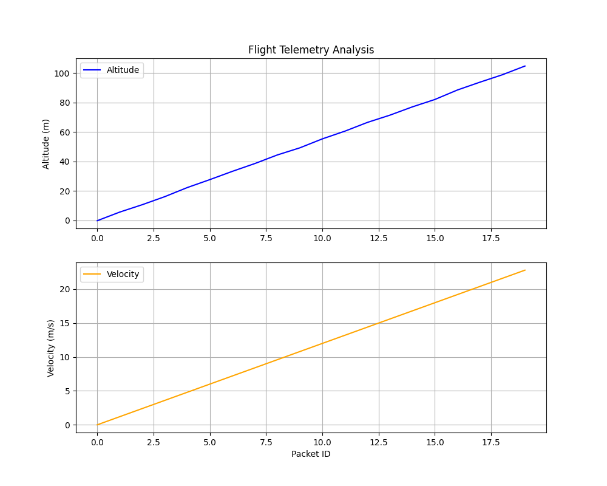

<div align="center">
  
  

  # 🚀 Teknofest Roket Yarışması 2026
  ### Karadeniz Teknik Üniversitesi Roket Takımı - Gelişmiş Görev Kontrol Sistemi

  [](https://teknofest.org/tr/)
  [](https://teknofest.org/tr/)
  [](https://www.python.org/)
  [](https://www.docker.com/)
  [](https://streamlit.io/)
  [](https://github.com/bahattinyunus/teknofest-rocket-2026/actions)
  [](LICENSE)

  <br>

  **"Göklerdeki istikbalimiz için, daha yükseğe! Yerli mühendislik, gelişmiş aviyonik."**

</div>

---

## 📑 İçindekiler
1. [Proje Özeti](#-proje-özeti)
2. [Sistem Mimarisi ve Akış](#-sistem-mimarisi-ve-akış)
3. [Teknik Özellikler ve Yenilikler](#-teknik-özellikler-ve-yenilikler)
4. [Detaylı Modül Açıklamaları](#-detaylı-modül-açıklamaları)
    - [4.1 Roket Simülasyonu](#41-roket-simülasyonu-sender_simpy)
    - [4.2 Yer Kontrol İstasyonu](#42-yer-kontrol-istasyonu-receiver_simpy)
    - [4.3 Görev Kontrol Paneli](#43-görev-kontrol-paneli-dashboardpy)
5. [Algoritmik Detaylar](#-algoritmik-detaylar)
    - [Fizik Motoru](#fizik-motoru)
    - [Kalman Filtresi](#kalman-filtresi)
6. [Haberleşme Protokolü](#-haberleşme-protokolü)
7. [Kurulum ve Çalıştırma Rehberi](#-kurulum-ve-çalıştırma-rehberi)
8. [Konfigürasyon](#-konfigürasyon)
9. [Galeri](#-galeri)
10. [Sıkça Sorulan Sorular (SSS)](/-sıkça-sorulan-sorular-sss)
11. [Katkıda Bulunma](#-katkıda-bulunma-contributing)
12. [Lisans ve İletişim](#-lisans-ve-i̇letişim)

---

## 📋 Proje Özeti
Bu proje, **Teknofest 2026 Roket Yarışması Yüksek İrtifa Kategorisi** için geliştirilmiş, uçtan uca bir **Aviyonik Simülasyon ve Yer Kontrol İstasyonu (GCS)** çözümüdür. Proje, roketin fırlatma anından kurtarma aşamasına kadar olan tüm uçuş profilini simüle eder, telemetri verilerini üretir, bu verileri yer istasyonuna aktarır ve görselleştirir.

Sadece bir simülasyon aracı olmanın ötesinde, bu yazılım gerçek uçuş bilgisayarı ile entegre edilebilecek modüler bir yapıya sahiptir. **Endüstriyel IoT standartları**, **Clean Code** prensipleri ve **DevOps** süreçleri (CI/CD, Docker) tam anlamıyla uygulanmıştır.

---

## 🏗️ Sistem Mimarisi ve Akış

Sistem, birbirinden izole edilmiş ancak ağ üzerinden haberleşen üç ana mikro servis üzerine kuruludur. Bu mimari, sistemin esnekliğini ve hataya karşı dayanıklılığını artırır.

```mermaid
graph TD
    subgraph "Uzay Segmenti (Roket)"
        Sender[🚀 Sender Simülatör]
        Physics[🧮 Fizik Motoru]
        UplinkRx[👂 Uplink Alıcısı]
        
        Sender -->|Sensör Verisi| Physics
        Physics -->|Durum Güncellemesi| Sender
        UplinkRx -->|Komut: ARM/LAUNCH| Sender
    end

    subgraph "Yer Segmenti (Ground)"
        Receiver[📡 Yer İstasyonu Alıcısı]
        Database[(💾 CSV Log Veritabanı)]
        Dashboard[🖥️ Görev Kontrol Paneli]
        Commander[🎮 Telekomut Modülü]

        Sender -->|UDP: 5005 (Telemetri)| Receiver
        Receiver -->|Veri Yazma| Database
        Database <-->|Veri Okuma (Refresh)| Dashboard
        Dashboard -->|Tetikleme| Commander
        Commander -->|UDP: 5006 (Komut)| UplinkRx
    end

    style Sender fill:#ff9999,stroke:#333
    style Receiver fill:#99ff99,stroke:#333
    style Dashboard fill:#99ccff,stroke:#333
```

---

## ✨ Teknik Özellikler ve Yenilikler

Bu repository, standart bir öğrenci projesinin çok ötesinde özellikler barındırır:

| Özellik | Detaylı Açıklama |
| :--- | :--- |
| **🚀 Gelişmiş 3D Fizik** | Roketin kütlesi, sürüklenme katsayısı (Cd), yerçekimi ve rüzgarın rastgele etkileri (buffeting) hesaba katılarak 6-DOF'a yakın bir simülasyon gerçekleştirilir. |
| **🌍 Coğrafi İşaretleme** | Simülasyon, roketin `(x, y)` sapmasını **Tuz Gölü**'nün gerçek GPS koordinatlarına (`38.8200° N, 33.3300° E`) dönüştürür. |
| **📈 Sinyal İşleme** | Sensör verilerindeki gürültü, özel olarak yazılmış **1-Boyutlu Kalman Filtresi** ile temizlenir. Bu sayede ham veri ile filtrelenmiş veri arasındaki fark gözlemlenebilir. |
| **🎮 Çift Yönlü Haberleşme** | Sistem "Fire & Forget" değildir. Yer istasyonundan gönderilen `ARM`, `LAUNCH` ve `FAIL` komutları roketi gerçek zamanlı kontrol eder. |
| **🖥️ Modern Dashboard** | Streamlit tabanlı arayüz; anlık metrikler, kayan grafikler, 3D yörünge görselleştirme ve harita takibi sunar. |
| **🐳 Docker Altyapısı** | Tüm bağımlılıklar ve servisler `docker-compose` ile paketlenmiştir. "Benim bilgisayarımda çalışmıyor" sorununu ortadan kaldırır. |

---

## 📦 Detaylı Modül Açıklamaları

### 4.1 Roket Simülasyonu (`sender_sim.py`)
Bu modül, roketin uçuş bilgisayarını taklit eder.
- **Multithreading:** Ana döngü fizik motorunu çalıştırırken, arka planda çalışan bir `Thread` yer istasyonundan gelen komutları dinler (Port 5006).
- **Durum Makinesi (State Machine):** Roket şu durumlardan birinde olabilir:
  - `IDLE`: Bekleme modu.
  - `READY`: ARM edildi, fırlatmaya hazır.
  - `ASCENT_BURN`: Motor yanıyor, ivmelenme.
  - `COASTING`: Motor sustu, serbest yükseliş.
  - `DESCENT`: Tepe noktası geçildi, paraşütle iniş.
  - `LANDED`: Yere temas.

### 4.2 Yer Kontrol İstasyonu (`receiver_sim.py`)
RF modülünden (burada UDP üzerinden) gelen veriyi karşılayan arayüzdür.
- **Port Dinleme:** UDP 5005 portunu sürekli dinler.
- **Veri Kaydı:** Gelen her paketi, analiz edilebilmesi için zaman damgasıyla birlikte `telemetry_log.csv` dosyasına kaydeder.
- **Hata Toleransı:** Bozuk paketleri veya JSON format hatalarını yönetir ve sistemin çökmesini engeller.

### 4.3 Görev Kontrol Paneli (`dashboard.py`)
Operatörün sistemi izlediği görsel arayüzdür.
- **Teknolojiler:** Python Streamlit, Plotly Express.
- **Özellikler:**
  - **Canlı Grafikler:** İrtifa, Hız ve İvme grafikleri saniyede bir güncellenir.
  - **Filtre Karşılaştırma:** Ham sensör verisi (Kırmızı) ile Kalman Filtresi çıktısı (Yeşil) üst üste çizilir.
  - **Fire Control:** Kenar çubuğundaki butonlar aracılığıyla `commander.py` kütüphanesini çağırarak komut gönderir.

---

## 🧠 Algoritmik Detaylar

### Fizik Motoru
Simülasyonda kullanılan temel kinematik denklemler:

$$ F_{net} = F_{itki} - F_{yerçekimi} - F_{sürüklenme} $$
$$ a = F_{net} / m $$
$$ v = v_0 + a \cdot \Delta t $$
$$ x = x_0 + v \cdot \Delta t $$

Uçuş sırasında rüzgar etkisi, rastgele üretilen bir `wind_vector` ile modele eklenir (`random.uniform(-0.5, 0.5)`).

### Kalman Filtresi
Ölçüm gürültüsünü (Measurement Noise - R) ve süreç gürültüsünü (Process Noise - Q) dengeleyerek en iyi tahmini yapar.
1. **Tahmin Adımı:** $x_{t|t-1} = x_{t-1|t-1}$
2. **Güncelleme Adımı:**
   - Kalman Kazancı: $K_t = P_{t|t-1} / (P_{t|t-1} + R)$
   - Durum Güncelleme: $x_{t|t} = x_{t|t-1} + K_t(z_t - x_{t|t-1})$

---

## 📡 Haberleşme Protokolü

Yer ve Roket arasında JSON formatında veri paketleri taşınır.

**Downlink (Roket -> Yer) Örnek Paketi:**
```json
{
  "team_id": 12345,
  "packet_id": 128,
  "timestamp": 14.5,
  "altitude": 125.4,
  "velocity": 45.2,
  "pos_x": 12.1,
  "pos_y": -5.3,
  "gps_lat": 38.8201,
  "gps_long": 33.3302,
  "status": "ASCENT_BURN"
}
```

**Uplink (Yer -> Roket) Komutları:**
- `ARM`: Sistemi aktif hale getirir.
- `LAUNCH`: Motoru ateşler.
- `DEPLOY_CHUTE`: Manuel paraşüt açar.
- `RESET`: Simülasyonu sıfırlar.

---

## 🚀 Kurulum ve Çalıştırma Rehberi

Projeyi çalıştırmak için aşağıdaki adımları takip edin.

### Ön Gereksinimler
- Python 3.9 veya üzeri
- Git
- (Opsiyonel) Docker Desktop

### 1. Depoyu Klonlayın
```bash
git clone https://github.com/bahattinyunus/teknofest-rocket-2026.git
cd teknofest-rocket-2026
```

### 2. Kurulum (Make ile)
```bash
make install
```
*Bu komut sanal ortam oluşturmaz, global veya aktif venv'e yükler.*

### 3. Çalıştırma
Sistemi parça parça veya bütün olarak çalıştırabilirsiniz.

**Tüm Sistemi Başlatmak İçin (Önerilen):**
Ayrı terminallerde sırasıyla:
1. `make run-ground` (Önce alıcıyı başlatın)
2. `make run-dashboard` (Arayüzü açın)
3. `make run-telemetry` (Simülasyonu başlatın)

**Docker ile Çalıştırma:**
```bash
make docker-up
```
Tarayıcınızda `http://localhost:8501` adresine gidin.

---

## ⚙️ Konfigürasyon

Sistem ortam değişkenleri (Environment Variables) ile konfigüre edilebilir. Varsayılan değerler aşağıdaki gibidir:

| Değişken | Varsayılan | Açıklama |
| :--- | :--- | :--- |
| `UDP_IP` | 0.0.0.0 | Alıcı dinleme adresi |
| `UDP_PORT` | 5005 | Telemetri portu |
| `TARGET_IP` | 127.0.0.1 | Simülatör hedef IP |
| `TARGET_PORT` | 5005 | Simülatör hedef port |
| `ROCKET_CMD_PORT`| 5006 | Uplink komut portu |

---

## 🖼️ Galeri

| Uçuş Analiz Grafiği | Görev Kontrol Ekranı |
| :---: | :---: |
|  | *Dashboard ekran görüntüsü buraya eklenecektir* |
| *Matplotlib ile oluşturulan uçuş sonrası analiz* | *Canlı veri akışı ve 3D yörünge* |

---

## ❓ Sıkça Sorulan Sorular (SSS)

**S: Proje Teknofest yarışma şartnamesine uygun mu?**
C: Evet, 2025 şartnamesi referans alınarak; hibrit/sıvı/katı yakıtlı roket senaryolarına uygun geliştirilmiştir.

**S: Gerçek donanımla nasıl test ederim?**
C: `receiver_sim.py` dosyasını modifiye ederek UDP yerine `pyserial` kütüphanesi ile LORA modülünden veri okuyacak şekilde ayarlamanız yeterlidir.

**S: Neden UTC zaman damgası kullanılmıyor?**
C: Simülasyon basitliği için `mission_time` (T+ saniye) kullanılmıştır. Gerçek uçuşta GPS zamanı kullanılacaktır.

---

## 🤝 Katkıda Bulunma (Contributing)

Bu proje açık kaynaklı topluluk desteği ile büyümektedir.
1. Forklayın.
2. `feature/yeni-ozellik` dalı oluşturun.
3. Commitlerinizi atın (`git commit -m 'Yeni özellik eklendi'`).
4. Dalınıza Pushlayın (`git push origin feature/yeni-ozellik`).
5. Bir Pull Request (PR) açın.

Lütfen [CONTRIBUTING.md](CONTRIBUTING.md) ve [CODE_OF_CONDUCT.md](CODE_OF_CONDUCT.md) dosyalarını incelemeyi unutmayın.

---

## 📜 Lisans ve İletişim

Bu proje MIT Lisansı ile lisanslanmıştır. Detaylar için `LICENSE` dosyasına bakınız.

<div align="center">
  <h3>🏆 Sponsorlarımız</h3>
  <table align="center">
    <tr>
      <td align="center" width="150"><br><b>Platin</b></td>
      <td align="center" width="150"><br><b>Altın</b></td>
      <td align="center" width="150"><br><b>Gümüş</b></td>
    </tr>
  </table>
  
  <br>

  <p>📬 İletişim: <a href="mailto:iletisim@ktu.edu.tr">iletisim@ktu.edu.tr</a></p>
  <p>© 2026 Karadeniz Teknik Üniversitesi Roket Takımı</p>
  <i>"İstikbal Göklerdedir" - K. Atatürk</i>
</div>
