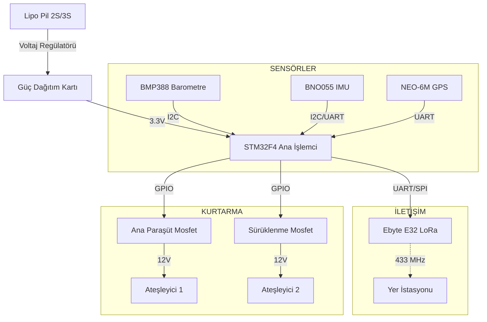

# Aviyonik Alt Sistemi

## 🎯 Hedefler
- Ana Bilgisayar ve Yedek Bilgisayar mimarisi.
- Çift yönlü haberleşme (433 MHz LoRa).
- SD Kart Loglama (50 Hz).

## ⚡ Güç Bütçesi
| Bileşen | Voltaj (V) | Akım (mA) | Güç (W) |
| :--- | :--- | :--- | :--- |
| STM32F4 | 3.3 | 100 | 0.33 |
| LoRa Modülü | 3.3 | 120 (Tx) | 0.40 |
| Sensörler | 3.3 | 50 | 0.16 |
| **TOPLAM** | | **270 mA** | **0.9 W** |

## 🔌 Bağlantı Şeması
- [ ] Ana Bilgisayar PCB Çizimi
- [ ] Güç Dağıtım Kartı Tasarımı

## 📦 Malzeme Listesi (BOM)
- STM32F407VG Discovery
- Ebyte E32 433T20D LoRa
- BMP388 Barometre (Yüksek hassasiyetli irtifa ölçümü)
- BNO055 IMU (Euler açılarını direkt verir, filtre gerektirmez)

---

## 🎓 Yeni Başlayanlar İçin Aviyonik
Aviyonik, roketin "elektronik beyni"dir.

### Temel Bileşenler
1.  **Uçuş Bilgisayarı (Flight Computer):** Sensör verilerini işler ve paraşütü tetikler. (Örn: STM32, Arduino, Teensy).
2.  **IMU (Inertial Measurement Unit):** İvmeölçer ve Jiroskop içerir. Roketin yönelimini ölçer.
3.  **Barometre:** Basınç değişimi ile irtifayı ölçer.
4.  **GPS:** Roketin düştüğü yeri bulmak için koordinat verir.

### Kaynaklar
*   [r/Rocketry Avionics Guide](https://www.reddit.com/r/rocketry/)
*   [ArduPilot](https://ardupilot.org/) (İleri seviye otopilot)

---

## ⚡ Bağlantı Şeması (Wiring Diagram)

